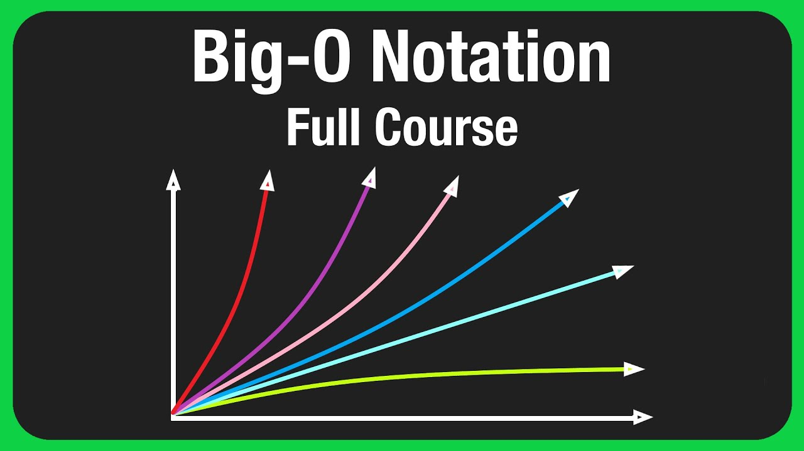
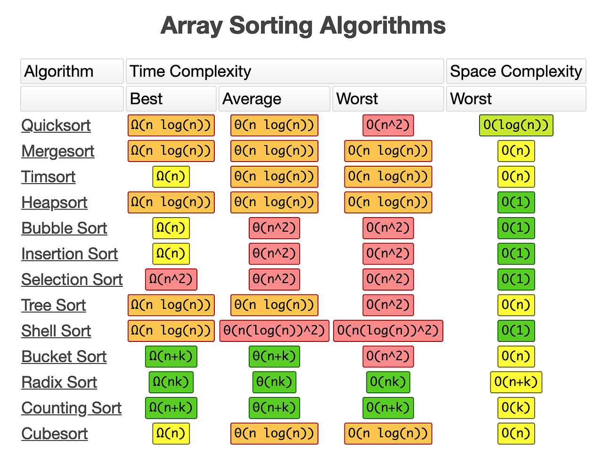
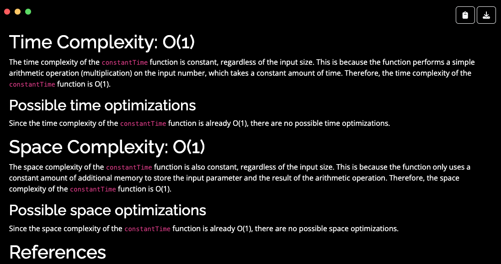
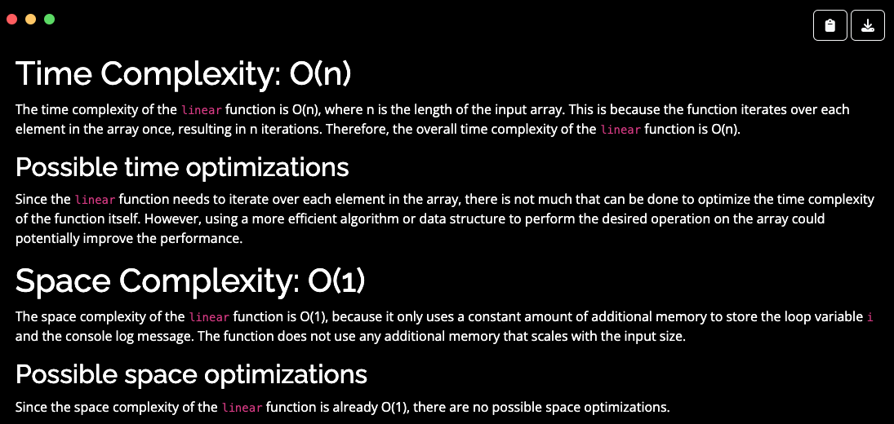
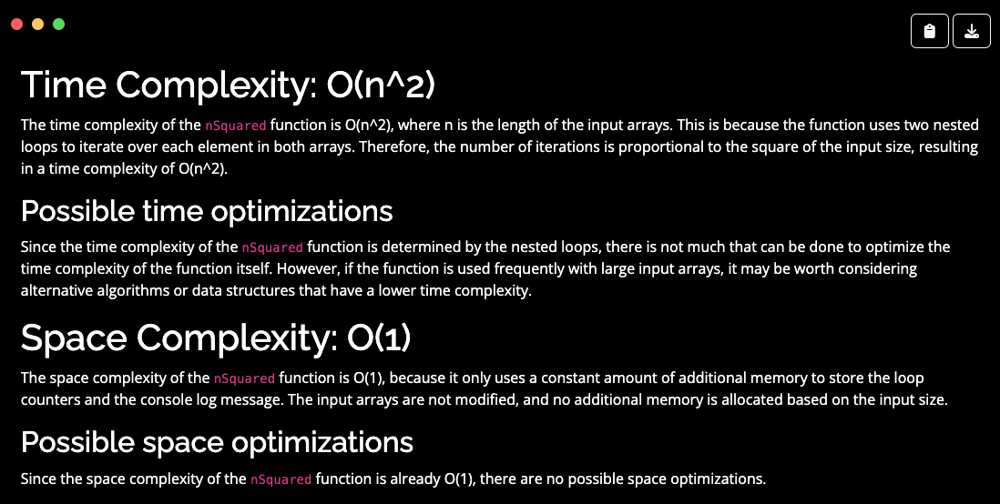
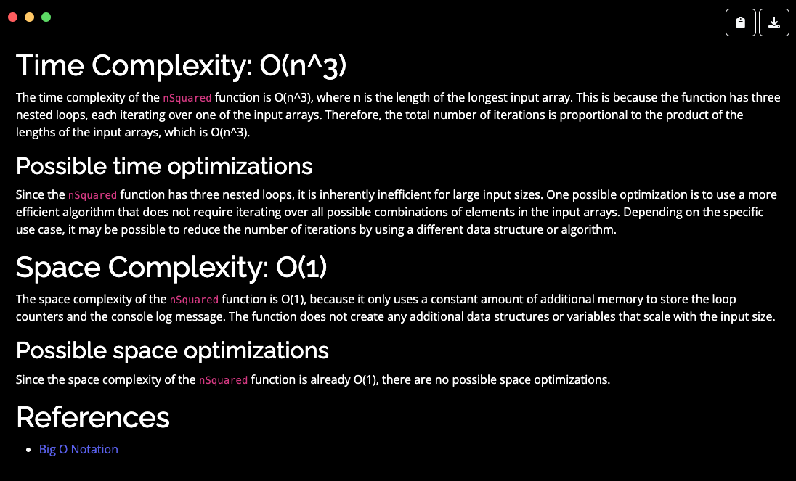
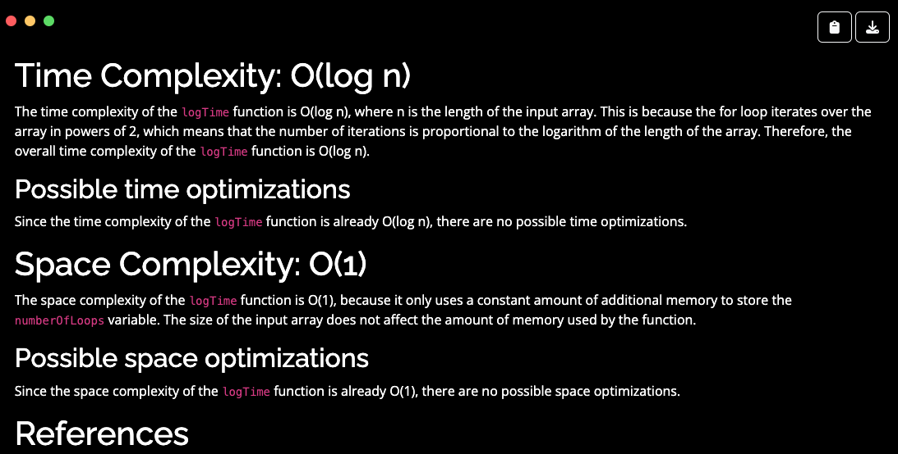
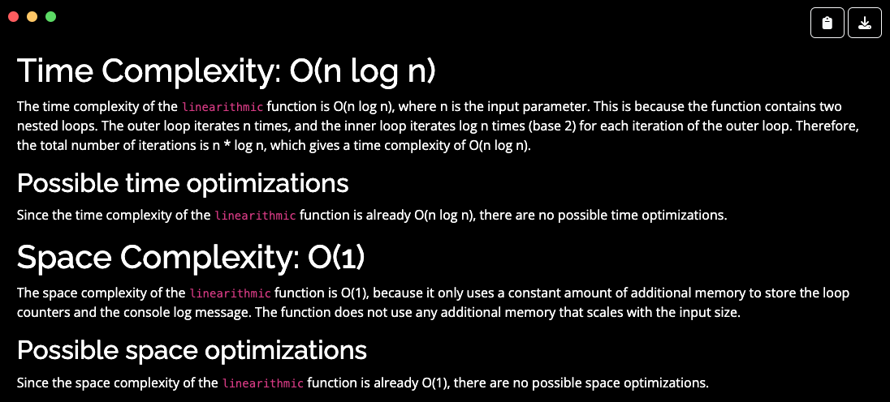
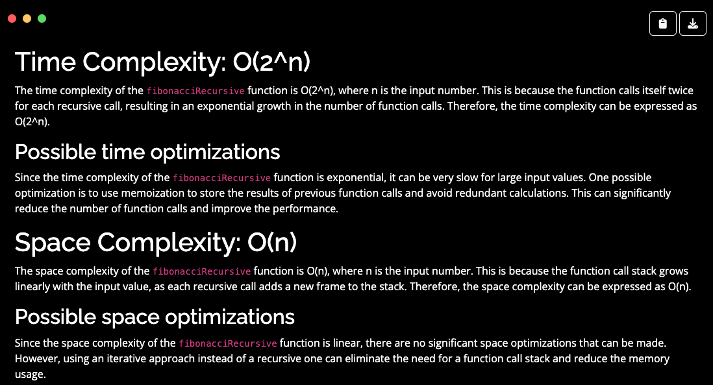
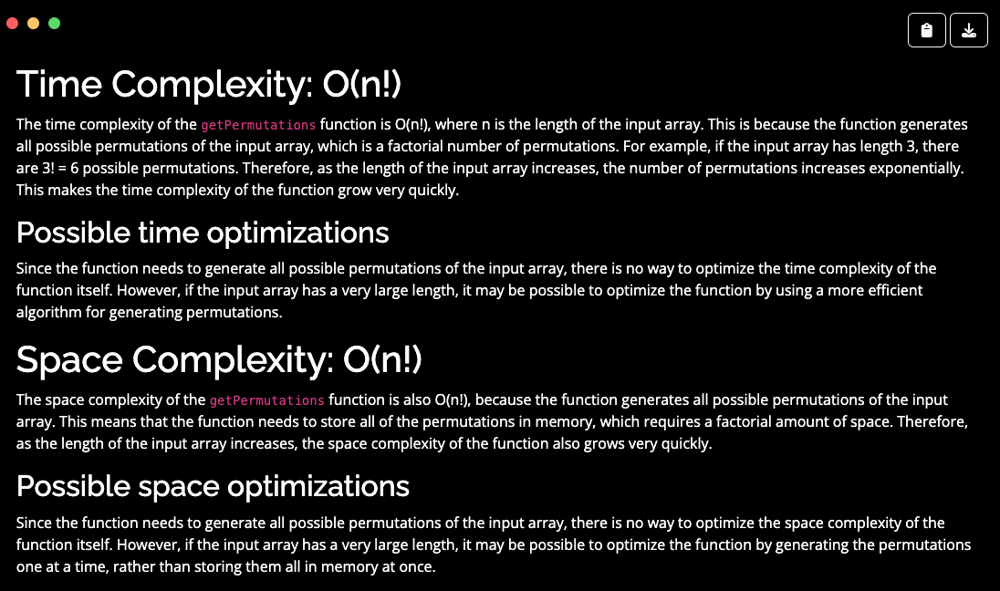

# Big O Notation


## Overview
It's been a long time since I've had to do real math. Either way `Big O` notation is a useful if not a quick bird's eye view of the time and space complexity of a function.
<details>
  <summary>Click to open diagram</summary>

  
</details>

## Explanations
All images are pulled from [CodePal's Big O Analyzer](https://codepal.ai/big-o-analyzer)

### `O(1)` – Constant time complexity: Big O(1)
**Why**: Constant time. Not matter what the operation the function can operate in constant time. For instance the following addition function. Or accessing an index of an array.

```js
const constantTime = (num) =>  2 * num
```

<details>
  <summary>Open</summary>

  
</details>


### `O(n)` - Linear time complexity
**Why**: This is because in order for the function to do it's operations it must go through every item in the array.
```js
const linear = (arr) => {
  for (let i = 0; i < arr.length; i++) {
    console.log(arr[i])
  }
}
```

<details>
  <summary>Open</summary>

  
</details>


### `O(n^2)` - Quadratic time complexity
**Why**: In this function we're iterating over each element in `arr2` for every element in `arr1`

```js
const nSquared = (arr1, arr2) => {
  for (let i = 0; i < arr1.length; i++) {
    for (let j = 0; j < arr2.length; j++) {
      console.log(`i: ${arr1[i]}; j: ${arr2[j]}`)
    }
  }
}
```

<details>
  <summary>Open</summary>

  
</details>


### `O(n^3)` - Cubed time complexity
**Why**: As the CodePal image says :
> Therefore, the total number of iterations is proportional to the product of the lengths of the input arrays, which is O(n^3).

```js
const nCubed = (arr1, arr2, arr3) => {
  for (let i = 0; i < arr1.length; i++) {
    for (let j = 0; j < arr2.length; j++) {
      for (let k = 0; k < arr3.length; k++) {
      console.log(`i: ${arr1[i]}; j: ${arr2[j]}`)
    }
  }
}
```

<details>
  <summary>Open</summary>

  
</details>


### `O(log(n))` - Logarithmic time complexity
**Why**: 

```js
const logarithmic = (arr) => {
  let numberOfLoops = 0

  for (let i = 1; i < arr.length; i *= 2) {
    numberOfLoops++
  }
  
  return numberOfLoops
}
```

<details>
  <summary>Open</summary>

  
</details>


### `O(n log n)` - Linearithmic time complexity
**Why**: It looks like it would be `O(n^2)` but we're doubling the input in the inner loop.

```js
function linearithmic(n) {
  for (let i = 0; i < n; i++) {
    for (let j = 1; j < n; j = j * 2) {
      console.log("Hello")
    }
  }
}

```

<details>
  <summary>Open</summary>

  
</details>


### `O(2^n)` - Exponential time
**Why**: When the number of operations doubles everytime we increase the input by 1. oof ...

```js
const exponential = (num) => {
  if (num === 0) {
     return 0
  } else if (num === 1) {
     return 1
  } else {
    return exponential(num - 1) + exponential(num - 2)
  }
}
```

<details>
  <summary>Open</summary>

  
</details>


### `O(n!)` - Factorial time complexity
**Why**: Stay away from these as these functions will annihilate your computer. A `factorial` is the product of every number UP TO that number. ie `3! → 1 x 2 x 3`. 

Further examples
```
1! = 1
2! = 2 x 1 = 2
3! = 3 x 2 x 1 = 6
4! = 4 x 3 x 2 x 1 = 24
5! = 5 x 4 x 3 x 2 x 1 = 120
```

This was pulled from 
```js
function getPermutations (arr) {
  if (arr.length <= 2) {
    if (arr.length === 2) return [arr, [arr[1], arr[0]]]
    return arr
  }
  return arr.reduce(
    (acc, item, i) =>
      acc.concat(
        getPermutations([...arr.slice(0, i), ...arr.slice(i + 1)]).map(val => [
          item,
          ...val,
        ])
      ),
    []
  );
}
```

This is an `O(n)` version. It's linear as it's doing an operation per the length of the `num` variable.
```js
const factorial = (num) => {
  let product = 1

  for (let i = 0; i < num; i++) {
    product = product * i
  }

  return product
}
```

<details>
  <summary>Open</summary>

  
</details>

## Footnotes & References
- Doable Danny, [Big O Notation in JavaScript | The Ultimate Beginners Guide with Examples](https://www.doabledanny.com/big-o-notation-in-javascript). 2021
- Şahin Arslan, [Comprehensive Big O Notation Guide in Plain English, using Javascript](https://www.sahinarslan.tech/posts/comprehensive-big-o-notation-guide-in-plain-english-using-javascript). 2021
- Kavyashree Arun, [Big O: The ultimate pillar of Programming](https://medium.com/codex/big-o-the-ultimate-pillar-of-programming-f8777c898f21). 2021
- [Know Thy Complexities](https://www.bigocheatsheet.com/)
- [Big O Notation and Time Complexity (Data Structures & Algorithms)](https://www.youtube.com/watch?v=Qn16oJ49AtM)
- [Cheatsheet diagram](./_assets/cheatsheet.pdf)
