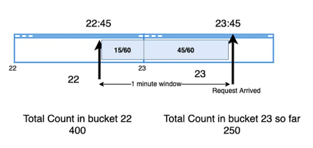
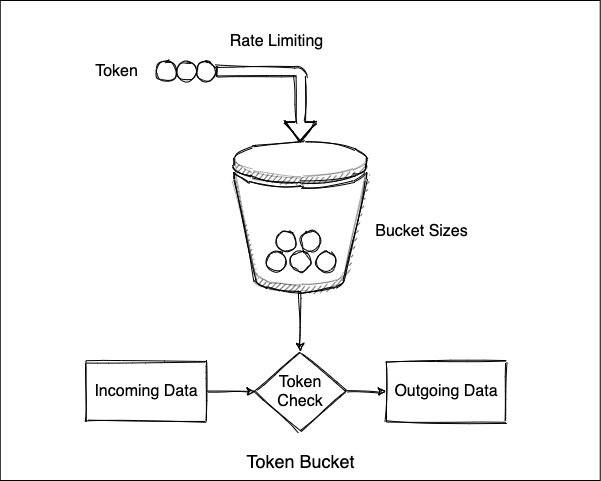
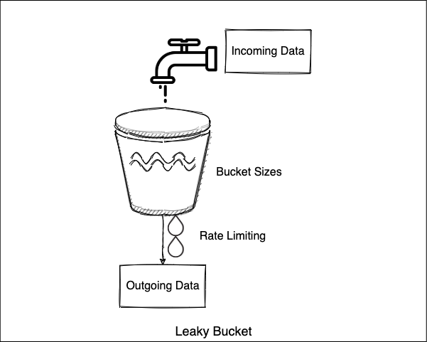

# Designing a Rate Limiter

- [Benefits of Rate Limiting](#benefits-of-rate-limiting)
  - [When to use](#when-to-use)
  - [Complications](#complications)
- [Questions to ask about requirements](#questions-to-ask-about-requirements)
  - [Functional requirements](#functional-requirements)
  - [Non-Functional requirements](#non-functional-requirements)
    - [Initial thoughts on requirements](#initial-thoughts-on-requirements)
- [Considerations](#considerations)
  - [Limiting Basis](#limiting-basis)
  - [If limiter component fails](#if-limiter-component-fails)
- [Algos](#algos)
  - [Fixed Window \& Sliding Window](#fixed-window--sliding-window)
  - [Token Bucket](#token-bucket)
  - [Leaky Bucket](#leaky-bucket)
  - [Counter](#counter)
  - [Sliding-Window Counter](#sliding-window-counter)
  - [Backoff (relazing limit)](#backoff-relazing-limit)
  - [Performance \& Optimization](#performance--optimization)
- [Citations \& Footnotes](#citations--footnotes)

Rate limiting is an approach to restricting the quantity of requests to a service within a given time range. A basic example is mitigating the effects of a `DDOS` attack. There are two options when deciding to use a rate limiter. The first option is to limit indiscriminately based on _n_ requests per _period_ (`Request Rate Limiter`) and the second makes it's decision based on the status of the entire system which is called a `load shedder`. The latter is used when part of the system has the potential to be uavailable or a service is processing slower than usual.

## Benefits of Rate Limiting
- Avoid resource starvation to protect the service for all customers
- Control the rate at which any given service recieves requests to limit the accumilation of processeing that a service would need to do 
- There is also an operational cost benefit as most distributed systems have the option of auto scaling and curbing excess requests will save money.

### When to use
When limiting the amount of requests a second will not affect the outcome of the requests for a user. e.g, A user wrote a script to query the documents in their file store 90x/min. This is a fine example to rate limit as the count of documents is not likely to change drastically within that time. 

### Complications
What if a service is down? This is when a *_load shedder_* would make the most sense a this technique takes into account the entirety of the system's state. e.g., One of your services

## Questions to ask about requirements
### Functional requirements
1. "What is the basis in which we want to rate limit? User ID, IP, Location?
1. "What is the size of this system?"
1. "Will we be doing this on the client or back end?" (server, seriously, are you insane?)
1. "What do we do if the rate limiter goes down?

### Non-Functional requirements
1. "What is the latency allowance?" (lowest possible, dur)
1. "What is the throughput of this component"
1. "How much and how will data be stored?"
1. "How many users are expected? This affects the amount of data that we will need to store"
1. "What type of availability do we require?" re: Fail Open or Closed?

#### Initial thoughts on requirements
The thing with a rate limiting component is you'll want it to barely have any impact on the functionality of your system. While it's a critical component it should *_NOT_* behave like a service where it's response time could vary. The most work it does will be to determine if requests are to be limited therefore we should strive for the lowest possible latency possible. Above all we want this component to behave like it's a pass-through.

But

A rate limiter needs to _remember_ who is who when they are making a request so decisions can be made based on that requester. Basically we need to save that ID somehow and since we want extremely low so it wouldn't behoove of us to use a disk storage mechanism to save that data. Not even a database (that's disk IO). Instead using `System Memory` (`RAM`) would be the most performant. 

Just remember, you'll need to know _HOW_ much RAM you'll need and that depends on the hash you'd use to identify requester IDs. Servers (or even AWS components) can easily handle 132GB of memory[^memory-angent]! 😳😳😳. 

About storage. `User + Requests Count`

If using `IP` address for example (`000.000.000.000`) and storing the number of requests (let's say 256bytes) with x number of users you would need X amount of storage. Given 100 million users and for each user we store their IP with the number of requests (let's go with 256 bytes) then that would require ~25GB of memory to run this rate limiter. Here is the calculation of stated example.

```
     100,000,000 users
x            256 bytes
----------------------------
= 26,500,000,000 bytes

----------------------------
=       24.68005 GB
```

{}
Rate limiting is something that requires swift responses so storing your deterministic data in a system that uses IO will be too slow so using something like `Redis` or in memory would be best.
{}

## Considerations
### Limiting Basis
It all depends on the applicaiton. For instance allowing API access to developers but they must have an account and use a `JWT` each time they hit an endpoint and make a request the designed system will rate limit them based on their account. Or, if this same system allows for endpoints to be hit w/o an account the system can limit based on IP which is more general.

### If limiter component fails
There options that system designers will use for network failure depending on business needs for that component and how it'll affect the rest of the system and user requests. All further content originated from the article [Fail Closed, Fail Open, Fail Safe and Failover: ABCs of Network Visibility](https://www.keysight.com/blogs/tech/nwvs/2020/05/20/fail-closed-fail-type-fail-safe-and-failover-abcs-of-network-visibility).

<!-- Would I like these better as columns? -->
**`Fail Open`**
| What is | When Used | Advantages |
|---|---|---|
| The system stays open when failure conditions are met but rather remains operational regardless of system status | When availability [access to the system] is more important to the business than security or operational costs. | Initial deployment of new code and there is a brief period of surface level testing is required and once the team is satisfied with the results the team can then switch over to `Fail Closed` |

**Real-world examples**
1. If it is unknown if a patient has insurance an emergency team will still treat the patient regardless. Access is more important than authentication to the service.
1. In the event of an emergency, e.g., a fire or earthquake in an office building, doors that typically require one to use a badge to enter will be be automatically unlocked so first responders can help the people inside or put out fires.

In either case authentication to the component/service would be re-enabled once the threat has been eliminated or subsided.

**`Fail Closed`**
| What is | When Used | Advantages |
|---|---|---|
| The system becomes unaccessable when failure conditions are met | Used when security is more important than access | Prevent incomint traffic so that systems do not become compromised |

**Real-world examples**
1. When attempting to access an online account and fails to input the correct password multiple times the system will stop allowing attempts for a few min or until a user passes their MFA checks (text/phone/email et al)
1. If a car is low on transmission fluid if the automobile reaches a high enough speed (or accelerates too quickly) will shut down the car to prevent any further damaage to the transmission.

## Algos
1. Determine how many requests per time period
2. How to handle spikes?

### Fixed Window & Sliding Window
<p align="center">
  
</p>

[^fixed-window] - Image Attribution

The `Fixed Window` algorithm is one of the easier algorithms to implement for a rate limiter but doing this would introduce spikes that could become an annoyance or even these spikes could harm the system over time as the requests aren't spread out. The benefit is that it's really easy to impliment but it isn't accurate as there could be spikes it is much easier on resoures (memory in this case).

An alternative is the `Sliding Window` algorithm. Instead of disreguarding the history of a user's requests this algorithm takes that into account. A drawback is storage. For every IP if we want to store the date of the last x requests (if our rule allows for 100 requests per second then we'd store 100 timestamps @ 4 bytes 😳😬😬). 

### Token Bucket
<p align="center">
  
</p>
[^bucket]: Image Attribution

### Leaky Bucket
<p align="center">
  
</p>
[^bucket]: Image Attribution

### Counter
### Sliding-Window Counter
### Backoff (relazing limit)
### Performance & Optimization

## Citations & Footnotes
- [Rate Limiting system design | TOKEN BUCKET, Leaky Bucket, Sliding Logs - YouTube](https://www.youtube.com/watch?v=mhUQe4BKZXs)
- [System Design Interview - Rate Limiting (local and distributed) - YouTube](https://www.youtube.com/watch?v=FU4WlwfS3G0)
- [API Rate Limiter System Design](https://www.enjoyalgorithms.com/blog/design-api-rate-limiter)
- [Design a Distributed Scalable API Rate Limiter](https://systemsdesign.cloud/SystemDesign/RateLimiter)
- [Scaling your API with rate limiters](https://stripe.com/blog/rate-limiters)

- [^bucket]: [What is Token Bucket and Leaky Bucket algorithms | Hans Blog](https://hansliu.com/posts/2020/11/what-is-token-bucket-and-leaky-bucket-algorithms.html)
- [^memory-angent]: Even though your hardware (virtual or physical) you'll need to account for the operational costs of the hardware used even at the firewall level and this depends on the traffic your system recieves and the money you can spend on this component of your entire system.
- [^fixed-window]: [Sliding Window- Fixed Rate : Practical Rate Limiting for Web APIs | by msingh | Medium](https://software-factotum.medium.com/sliding-window-fixed-rate-practical-rate-limiting-for-web-apis-c8408a070e4c)

