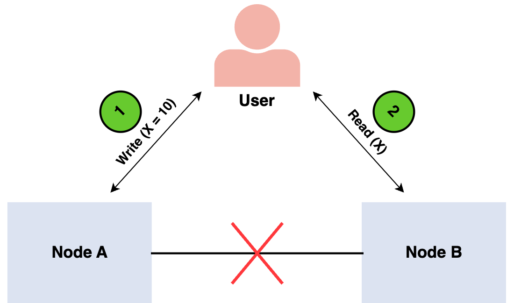

# Availability vs Consistency
- [CAP Theorem](#cap-theorem)
  - [CP - Consistency \& Partition Tolerance](#cp---consistency--partition-tolerance)
  - [AP - Availability \& Partition Tolerance](#ap---availability--partition-tolerance)
- [Citations \& Footnotes](#citations--footnotes)

## CAP Theorem

  
   
  <i><a href=http://robertgreiner.com/2014/08/cap-theorem-revisited>Source: CAP theorem revisited</a></i>

`CAP` Theorem is all about tradeoffs with determining how to build out a distributed database/system. 

In a distributed computer system, you can only support two of the following guarantees:

| Part | Translation         | Definition                                                                                                                                                                                                                                                                                                |
| ---- | ------------------- | --------------------------------------------------------------------------------------------------------------------------------------------------------------------------------------------------------------------------------------------------------------------------------------------------------- |
| `C`  | Consistency         | Every read receives the most recent write or an error. In a consistent system, all nodes see the same data simultaneously. This means that the system is not "eventually consistent" but consistent at all times.                                                                                        |
| `A`  | Availability        | Every request receives a response, without guarantee that it contains the most recent version of the information. When availability is present in a distributed system, it means that the system remains operational all of the time but this does not mean uptime like we normally would read this term. |
| `P`  | Partition tolerance | The system continues to operate despite arbitrary partitioning due to network failures. To have partition tolerance, the system must replicate records across combinations of nodes and networks.                                                                                                        |

*Networks aren't reliable, so you'll need to support partition tolerance. You'll need to make a software tradeoff between consistency and availability.*

### CP - Consistency & Partition Tolerance
Waiting for a response from the partitioned node might result in a timeout error. CP is a good choice if your business needs require atomic reads and writes.

### AP - Availability & Partition Tolerance
Responses return the most readily available version of the data available on any node, which might not be the latest. Writes might take some time to propagate when the partition is resolved.

AP is a good choice if the business needs to allow for [eventual consistency](./consistency-patterns.md) or when the system needs to continue working despite external errors.

## Citations & Footnotes
* [CAP theorem revisited](http://robertgreiner.com/2014/08/cap-theorem-revisited/)
* [A plain english introduction to CAP theorem](http://ksat.me/a-plain-english-introduction-to-cap-theorem)
* [CAP FAQ](https://github.com/henryr/cap-faq)
* [The CAP theorem](https://www.youtube.com/watch?v=k-Yaq8AHlFA)
