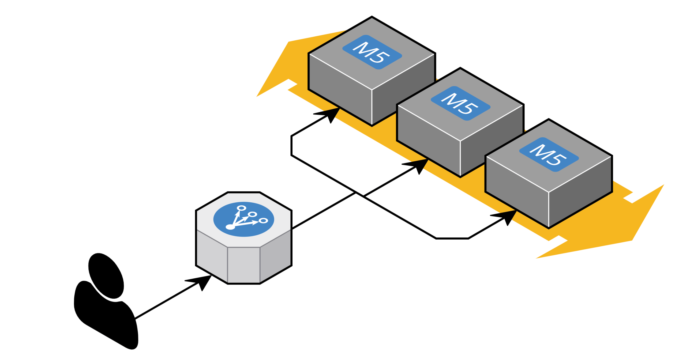

# Design Fundamentals
System Design is about large-scale systems & big data. It's about designing systems/platforms that handle large datasets, large traffic and blazing fast performance in the face of those challenges. Designing a large system also includes making it easy (or at least consistent) for engineers to solve business problems. Having a performant system will be of no benefit if adding new features or fixing bugs slows everything to a crawl. It isn't beneficial to the organization or your mental state/morale.

## About Computers
Not just your local machine but the servers and systems that are all components that are composed together to create a coherent platform. I will not go over computer architecture as it is so basic (and most people already know it anyhow) but it should be known that this is important to understand as it is the underpinnings of all decisions one would one would make when designing a system. Though, I should note, that this would be even more important if you need to write code that gets close to bare metal. The closer one gets to machine code the more indepth knowledge one is required to have to make proper use of the computer so as to not destroy the machine and can have good performance.

### Application Architecture
I'm going to breeze through this section because if you've worked in a professional setting for at least 6 months you'll know most of this already just from experience.

If the basic building blocks of a computer are used in tandem to create a machine that allows someone to use applications for various purposes like watching/listening to media on a streaming provider's platform, using a chat app or any of the multitudes of networked applications then application architecture is the composition of many of these computers in some configuration. 

One example is beefing up a computer's components. For instance adding a bigger CPU, a beefier graphics card or more and specialized RAM. Anotrher common (for applications that will serve many users) example of this is `Horizontal Scaling` of systems. This allows for better/easier scaling. Essentially computer replicas that work together. Both approaches can also be used. Building really beefy machines and replicating them. There is sort of the benefit of both but this is something costly to maintain and difficult to scale.

[^horscale]

## Networking
Networking is so important as the Internet could not exist without it and all our devices (smart phones, computers, tablets, refrigerators etc) are interconnected via the Internet. Networking is so important to KNOW because if we intend to build application architectures for internet enabled applications we need to understand not only that data travels over the wire but how it does so and how it's deciphered on the other end.

### Protocols
### DNS

## APIs
### HTTP
### Websockets
### Paradigms
### Design

## Caching
### CDNs

## Proxies
### Load Balancing
### Consistent Hashing

## Persistent data
### Relational Databases (`SQL`)
### NoSQL
### Replication
### Sharding
### `CAP`
### Message Queues
### `MapReduce`

---
[^horscale]: Michael Wittig, [How to Choose the Best Way to Scale EC2 Instances](https://blog.cloudcraft.co/how-to-choose-the-best-way-to-scale-ec2-instances-when-faced-with-changing-demand/), 2021
