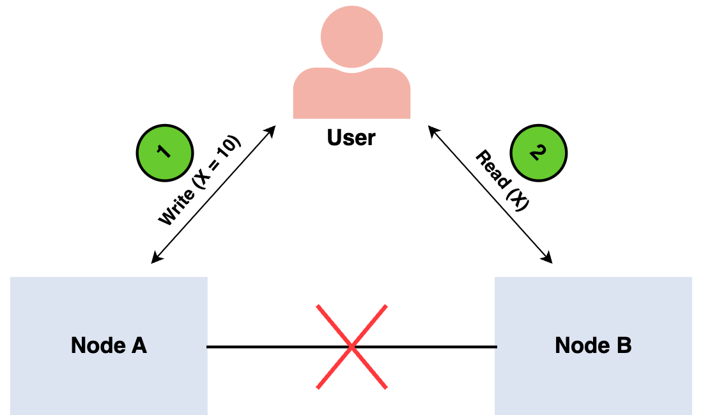

# Design Fundamentals

- [Design Fundamentals](#design-fundamentals)
  * [About Computers](#about-computers)
  * [Application Architecture](#application-architecture)
    + [Horizontal Scaling](#horizontal-scaling)
    + [Other Prerequsites](#other-prerequsites)
      - [Main bits of an architecture](#main-bits-of-an-architecture)
  * [Networking](#networking)
    + [`TCP/IP`](#-tcp-ip-)
    + [Basic Technology](#basic-technology)
      - [`RPC`](#-rpc-)
      - [`HTTP`](#-http-)
    + [Domain Name System](#domain-name-system)
      - [Quick Tangent](#quick-tangent)
    + [Protocols](#protocols)
      - [`SSH`](#-ssh-)
      - [`FTP`](#-ftp-)
      - [`SMTP`](#-smtp-)
      - [`Websockets`](#-websockets-)
  * [APIs](#apis)
    + [Paradigms](#paradigms)
      - [`REST`](#-rest-)
      - [`GraphQL`](#-graphql-)
      - [`gRPC`](#-grpc-)
    + [Design](#design)
  * [Caching](#caching)
    + [When `Caching` is appropriate and useful:](#when--caching--is-appropriate-and-useful-)
  * [Proxies](#proxies)
    + [Load Balancing](#load-balancing)
    + [Content Delivery Networks (`CDN`)](#content-delivery-networks---cdn--)
    + [Consistent Hashing](#consistent-hashing)
  * [Persistent data](#persistent-data)
    + [Relational Databases (`SQL`)](#relational-databases---sql--)
      - [`ACID`](#-acid-)
    + [`NoSQL`](#-nosql-)
    + [Replication](#replication)
    + [`Sharding`](#-sharding-)
    + [Replication](#replication-1)
    + [Last alternative](#last-alternative)
    + [`CAP` Theorm](#-cap--theorm)
    + [Message Queues](#message-queues)
    + [`MapReduce`](#-mapreduce-)
  * [References](#references)
  * [Citations](#citations)

System Design is about large-scale systems & big data. It's about designing systems/platforms that handle large datasets, large traffic and blazing fast performance in the face of those challenges. Designing a large system also includes making it easy (or at least consistent) for engineers to solve business problems. Having a performant system will be of no benefit if adding new features or fixing bugs slows everything to a crawl. It isn't beneficial to the organization or your mental state/morale.

Okay, so, as with everything in life System Design is about tradeoffs. Which language and why? Which server architecture and why? Which service providers and why? Build your own API Gateway or use an off-the-rack one? And why. It's all about how to make the best decisions for your team and organization. System Design and Software Engineering is about data. Moving it, storing it or transforming it. 

```
Storing - Saving data into RAM temporarily, putting it into a data store (db) or onto files (typically configurations)
Moving - Data moving from server to server, dbs to to application & vice versa, between services within your own network
Transforming - 
```

## About Computers
Not just your local machine but the servers and systems that are all components that are composed together to create a coherent platform. I will not go over computer architecture as it is so basic (and most people already know it anyhow) but it should be known that this is important to understand as it is the underpinnings of all decisions one would one would make when designing a system. Though, I should note, that this would be even more important if you need to write code that gets close to bare metal. The closer one gets to machine code the more indepth knowledge one is required to have to make proper use of the computer so as to not destroy the machine and can have good performance.

## Application Architecture
I'm going to breeze through this section because if you've worked in a professional setting for at least 6 months you'll know most of this already just from experience.

If the basic building blocks of a computer are used in tandem to create a machine that allows someone to use applications for various purposes like watching/listening to media on a streaming provider's platform, using a chat app or any of the multitudes of networked applications then application architecture is the composition of many of these computers in some configuration. 

One example is beefing up a computer's components. For instance adding a bigger CPU, a beefier graphics card or more and specialized RAM. Anotrher common (for applications that will serve many users) example of this is `Horizontal Scaling` of systems. This allows for better/easier scaling. Essentially computer replicas that work together. Both approaches can also be used. Building really beefy machines and replicating them. There is sort of the benefit of both but this is something costly to maintain and difficult to scale.


[^app-arch] - Image Attribution

### Horizontal Scaling

[^horscale] - Image Attribution

### Other Prerequsites
These prerequsites are what help us determine if our design is a good one or if there are tweaks that need to be made.

| Prerequsites| What/Why |
|---|---|
| Fault Tolerance | Can a server go down and the app still stay up? This is usually handled by redundancy. |
| Redundancy | Scaling. It's good to have redundancy so there is leeway of failure without the entire system falling into chaos. |
| Reliability | What is the expectation that the whole or part of the system will fail? ex: Can `DDOS` won't bring the system down. |
| Availability | The uptime. Shoot for 99.9999%. Seriously. [SLO/SLA/SLI](https://www.atlassian.com/incident-management/kpis/sla-vs-slo-vs-sli). |
| Throughput | How much data can be requested and responded by users of the system. |
| Latency | How long it takes to respond to a request. Slow operations, slow network, poorly designed databases etc all affect the latency of an application |

#### Main bits of an architecture
- Logging Service
- Metrics Service
- Horizontal Scaling
- Database (`SQL`, `NoSQL`, `Graph`)
- CI/CD
- Repo (usually `Git`, at least for now)
- API Gateway
- Load Balancer
- Alerting

## Networking
Networking is so important as the Internet could not exist without it and all our devices (smart phones, computers, tablets, refrigerators etc) are interconnected via the Internet. Networking is so important to KNOW because if we intend to build application architectures for internet enabled applications we need to understand not only that data travels over the wire but how it does so and how it's deciphered on the other end.

### `TCP/IP`
`TCP/IP` breaks down the data that will be sent over the wire and they are ordered so that they can be reassembled on the requesting machine. It's a powerful and reliable network powerful for those reasons and is why `HTTP` & `Websockets`, for instance, are built on `TCP/IP`. `TCP/IP` also does retransmission. For instance if a packet is lost then the requester can re-request that specific packet because of the packet ID. This makes it hella reliable.

Quick note on `UDP`. It is meant for speed. Used in applications like gaming, music/video streaming and calling. `TCP/IP` is great for data that needs to be in order and consistant but if you use it in something like meda streaming then it'll re-request packets and slow things down. Even worse it can make the audio sound really odd when it is getting back up to speed.

### Basic Technology
#### `RPC`
`RPC` translates to Remote Procedure Call. 
> Remote Procedure Call is a software communication protocol that one program can use to request a service from a program located in another computer on a network without having to understand the network's details. RPC is used to call other processes on the remote systems like a local system. - Tech Target [^rpc]

It is a client → server model. This means that a client (your computer, a server et al) makes a request to another machine (server) in order to run a function on the server (procedure). 

#### `HTTP`
The Internet protocol. As engineers and architects we primarily use `TCP/IP`. `HTTP` is an application layer that is built on top of `TCP/IP`.  `HTTP` is stateless. `HTTP` uses "METHOD"s to tell the server _what_ behavior the requester wants. 

| Common Methods[^http-methods] | Explaination |
|---|---|
| `GET`  | The `GET` method requests a representation of the specified resource. Requests using GET should only retrieve data. |
| `PUT`  | The `PUT` method replaces all current representations of the target resource with the request payload |
| `POST`  | The `POST` method submits an entity to the specified resource, often causing a change in state or side effects on the server |
| `DELETE`  | The `DELETE` method deletes the specified resource |

Quick note on security. HTTP on it's own isn't inherently secure so the `SSL` & `TLS` protocols were introduced. It's the `s` at the end of `https://`

### Domain Name System
A `DNS` is a map of `IP`s to a domain name and is spread across the public network. Also used in your router, NAS etc to remember which machine is which when they are being requested.

#### Quick Tangent
Q: Why is it important for software engineers to know the networking layers (at least `TCP/IP`)?

Answers:
1. Architecture Design: One must understandthe protocols so architectures can be designed to be performance and durable.
1. Debugging/Bug fixing: There are times, not often, where a bug will surface and it comes down to an edge case in server communication (server-to-server, server-to-client etc)
1. Websockets, REST, 
1. Setting up containers with intercommunication
1. The higher the traffic and application recieves he more important knowing the protocols will be. 

*_NOTE_*: The instances where knowing the networking layers intimately are exceedingly rare but knowing at least the bases is important. Especially for interviews as, for some ungodly reason, people like to ask about the Layers. If so make sure to ask if engineers have to use that knowledge often. I would be annoyed if I have to as I prefer to work _inc deo_ versus being low level often.

### Protocols

There are a few protocols such as `SSH`, `FTP`, `SMTP` and `Websockets`. I will go over these quickly.

#### `SSH`
... TODO

#### `FTP`
... TODO

#### `SMTP`
... TODO

#### `Websockets`
`Websockets` is a way to open two-way communication between two machines. It is possible to do this with `HTTP` and polling but polling is an inefficient method of aquiring up-to-date data from a source. For instance with `HTTP` whenver a request is made the application (browser, server) is required to make a new network request each time and if the application being developed is, for instance, a chat app like `Discord` then polling will quickly get out of hand. A better method to achieve the same results is the `Websockets` techology.

`Websockets` creates a "handshake" between the client and server which creates a persistent connection to the server. This allows for bi-direction communication. Think of it as an event pased communication between machines. One could say that `Websockets` are an outdated technology in the presense of `HTTP/2` as that new protocol added streaming.

## APIs
### Paradigms
#### `REST`
> Learn about the REST (Representational State Transfer) paradigm and how rest architecture streamlines communication between web components.

`REST` is a web standard for communication from machine-to-machine. The biggest benefit is that it's human readable and [many] web languages have native support. It is bulky, tho, as it is just a string that is sent over the wire and even when it's compressed it can still be a hefty response. Another drawback is `REST` APIs [can] suffer from unwieldy architecture when the API becomes large. Oftentimes you will see/work with`REST` APIs that have similar responses for different endpoints (not via `HTTP METHOD`) as it will be easier to develop a new endpoint instead of modifying the existing one as it could introduce a breaking change. Many architectures leverage some sort of versioning system to handle breaking changes for the same endpoint.

#### `GraphQL`
Is another API standard for making requests from the server but is more targeted and works more like a schema. I will not go further into this one as it is a whole topic on it's own and I haven't really had a change to work with `GraphQL`. The benefit of `GraphQL` is instead of making multiple requests like `REST` one makes a single request for everything required for a request. `GraphQL` also won't "overfetch" as is comming in `REST` as, again, one only requests what is directly needed for any given request.

This can also be done with `REST` but that requires one to develop those options whereas using `GraphQL` is simpler and already built out in order to do just that.

#### `gRPC`
Same as `GraphQL` I haven't used this in order to really say anything about it but NeetCode says:
> Introduced by Google `gRPC` is used, typically, in server-to-server communication. It uses Protocol Buffers which is a way to send data as binary across the wire.

### Design
I'm not going to write up an API design section since this is a very broad topic for this document so instead I'll share some links. Maybe in the future (most likely not) i'll update this or add a new document to go over the best pracices.

- [REST API Best Practices and Standards in 2023](https://hevodata.com/learn/rest-api-best-practices/)
- [REST API Best Practices – REST Endpoint Design Examples](https://www.freecodecamp.org/news/rest-api-best-practices-rest-endpoint-design-examples/)
- [REST API Design Best Practices to Follow](https://document360.com/blog/api-design-best-practices/)
- [Best Practices for Designing a Pragmatic RESTful API | Vinay Sahni](https://www.vinaysahni.com/best-practices-for-a-pragmatic-restful-api)
- [Web API design best practices - Azure Architecture Center | Microsoft Learn](https://learn.microsoft.com/en-us/azure/architecture/best-practices/api-design)

## Caching
I personally do not like `Caching` in most instances but in one that I do feel it works well is a `CDN`. Another good time to cache is local development. For instance `nx` caches changes to code and tests so that things are compliled quicker. I typically do not like `Caching` for runtime software as it makes things more complicated and usually too difficult to implement correctly and as engineers our products will rarely benefit from writing (and sometimes using packages/services) is also troublesome as you don't want to be bug fixing this code. 

AAAAAAANYway, `Caching` can be done in different ways. For instance at the computer level the computer can `Cache` operations/functions in `RAM` or in the `CPU`

### When `Caching` is appropriate and useful:
- `CDNs`
- *_SOME_* DB queries
- `Memoization` of functions

## Proxies

[^server-proxy] - Image Attribution

A proxy is a server in the middle of your back end. Simply.  

### Load Balancing

[^load-bal] - Image Attribution

A `Reverse Proxy` (note, I hate this name) _balances_ the load and spreads it across servers (in a horizontal setup). Goal is to split the requests to all the servers evenly. This can be done with a "Round Robin" approach (each request goes to a different server) or to use a hashing algorithm to determine which server the request will be relayed to. 

If servers are in different locations across the world (or even just timezones) the `Load Balancer`(s) can direct traffic to nearest geographical server [cluster]. 

### Content Delivery Networks (`CDN`)
Like the previous sentence in the `Load Balancers` a `CDN` spaces out traffic across servers. A `CDN` does not run any application logic but rather serves up static files. They work by taking your uploaded static files and copies them across the `CDN` network. `CDN`s can push or pull. `Pushing` is copying to the network. An alterative approach is `Pulling` which works by copying the static files either "Just in Time" when there is a request or the origin server tells the others files are ready and then each `CDN` pulls the files from the origin.

### Consistent Hashing

[^load-bal] - Image Attribution

Consistent Hashing is a way to consistently route a request to the same server every time. Consistent Hashing does not guarantee that load will be "balanced" if you're employing a weak algoritm (re: unbalanced binary tree) but if each server can cache an IP's request then the benefit is easy to recognize. That requester that is always going to the same server will recieve their response quickly as it's pulling from the cache instead of running the function each time. This could be more difficult to achieve w/o consistent hashing.

Simplistic algorithms will create more problems than they're worth (using server count/`%` for instance). If a server goes down then the hashing algo will change and now the request are going to different servers entirely.

For more detailed info: [Designing Consistent Hashing](./design-consistent-hashing.md)

## Persistent data
### Relational Databases (`SQL`)
Storing data in a structured format. FYI databases use binary trees to store data and has [blazing] fast retrieval especially when the database is normalized well and properly indexed.

#### `ACID`
```
A - Atomicity → Every transaction is "All or Nothing"
C - Consistancy → FKs will always be enforced
I - Isolation → Different concurrent transactions will not collide
D - Durability → Data is saved so even if the database is restarted the data will still exist and is retrievable (unless in a container 😬)
```

### `NoSQL`
Storing data in a non-structured format. Often uses `JSON` like `MongoDB`. I don't love this one for most uses but for logging, caching and/or copious amounts of non-relation data it's amazing. Big issue with data schema changes tho as the code would have to account for that and that usually means a ton of conditionals in code and that would make it very hard to decipher.

`NoSQL` foregoes the foreign key constraints. This can also be done in a relational DB but requires the developers to be very cognizant of their query mutations so as to not make the data murky/inconsistant.

### Replication
### `Sharding`
No, not a joke. `Sharding` is when one can break up a database as the foreign key constraint allows for this. Sharding keys are used to find where the data is located on each shard. 

### Replication
As Sharding can get complicated replication is a simpler way to handle data splitting. While easier it can be difficult to maintain in it's own right. "Leader → Follower Replication" DBs can have issues of replicating data and then the two are out of sync, for instance.

### Last alternative
Another approach is to use a CQRS-type design where the data is broken up by read & writes into different microservices and storing all the data into a large log database. This is an incredibly simplified explaination. 

### `CAP` Theorm
`CAP` Theorm is all about tradeoffs with determining how to build out a distributed database/system. 


[^cap-theorm] - Image Attribution

| Part | Translation | Definition |
|---|---|---|
| `C`  | Consistency | In a consistent system, all nodes see the same data simultaneously. This means that the system is not "eventually consistent" but consistent at all times. |
| `A`  | Availability  | When availability is present in a distributed system, it means that the system remains operational all of the time but this does not mean uptime like we normally would read this term. |
| `P`  | Partition tolerance | To have partition tolerance, the system must replicate records across combinations of nodes and networks. |

Cannot have all 3. 

### Message Queues
A Message Queue maintains durability (each message) and can be sharded or replicated. They maintain a queue of messages that can be processed as they come in or later (durability) if the system is restarted. Often used if the traffic is large and is more than an application can handle. Since the queue is maintained it can be processed as is needed. A benefit is that an application can be decoupled from each other (microservices).

### `MapReduce`
A powerful Big Data technique of splitting up data and allowing for computations to be spread across services.

![Map Reduce Diagram]](./_map-reduce.jpg)
[^map-reduce] - Image Attribution

There are two ways to process data. `Batching` or `Streaming`. Batch processing the data is available on the outset and processed ad-hoc e.g., `REST` request, `ETL`. Streaming is realtime. In `MapReduce` the data is split up for performance to process large, large sets of data.

---
## References
- NeetCode, [20 Concepts in 10 min](https://www.youtube.com/watch?v=i53Gi_K3o7I), 2023
- Kousik Nath, [Understanding TCP internals step by step for Software Engineers and System Designers](https://codeburst.io/understanding-tcp-internals-step-by-step-for-software-engineers-system-designers-part-1-df0c10b86449), 2019
- [yannis](https://softwareengineering.stackexchange.com/users/25936/yannis), [Should a web developer understand TCP/IP and how routers manage requests?](https://softwareengineering.stackexchange.com/questions/66569/should-a-web-developer-understand-tcp-ip-and-how-routers-manage-requests), 2011
- Quora, [Do software engineers often need to know a lot about networks?](https://www.quora.com/Do-software-engineers-often-need-to-know-a-lot-about-networks), 2020
- Codeccademy, https://www.codecademy.com/article/what-is-rest, [What is Rest?](https://www.codecademy.com/article/what-is-rest), 

## Citations
[^app-arch]: lanars.com, [Web application architecture best practices](https://lanars.com/blog/web-application-architecture-best-practices)

[^horscale]: Michael Wittig, [How to Choose the Best Way to Scale EC2 Instances](https://blog.cloudcraft.co/how-to-choose-the-best-way-to-scale-ec2-instances-when-faced-with-changing-demand/), 2021

[^rpc]: [Remote Procedure Call (RPC)](https://www.techtarget.com/searchapparchitecture/definition/Remote-Procedure-Call-RPC)

[^http-methods]: [HTTP request methods](https://developer.mozilla.org/en-US/docs/Web/HTTP/Methods)

[^server-proxy]: [Using HTTPS over a reverse proxy in Laravel](https://cylab.be/blog/122/using-https-over-a-reverse-proxy-in-laravel)

[^load-bal]: [Load Balancing - KeyCDN Support](https://www.keycdn.com/support/load-balancing)

[`cap-theorm]: [System design fundamentals: What is the CAP theorem?](https://www.educative.io/blog/what-is-cap-theorem)

[^map-reduce]: [PPT - Sort in MapReduce PowerPoint Presentation, free download - ID:2492674](https://www.slideserve.com/teneil/sort-in-mapreduce)
