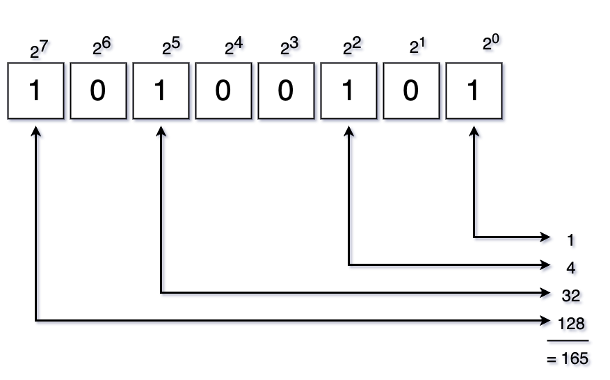

# Bit Shifting - Thoughts
As JavaScript becomes more ubiquitous and powerful the more seriously it will be taken.
Therefore if we plan to become better software engineers we must then learn more about
and become more efficient with bitwise operators and bit shifting and all that awful nonsense.

While the readability is awful, just, just awful, it is very powerful and often faster than
standard libraries. So in here I have a bunch of different methods that utilize one operation
and the tests are located in the `tests/bit-shifting` directory.

## Base 2 Number System (Binary)
Each one of these are set to the column. Just look at the image below.

| `Exponent`    | `Value` |
|:--------------|:--------|
| 2<sup>0</sup> | 1       |
| 2<sup>1</sup> | 2       |
| 2<sup>2</sup> | 4       |
| 2<sup>3</sup> | 8       |
| 2<sup>4</sup> | 16      |
| 2<sup>5</sup> | 32      |
| 2<sup>6</sup> | 64      |
| 2<sup>7</sup> | 128     |

Given the above table and a binary number of `10100101` as shown below we add up the values to get the number which, in this example, would be `165`. There are Decimal → Binary online conversions[^1] to confirm if needed.



[`NOTE`]: The two functions (color conversions) were learned from the ["A guide to JavaScript bitwise operators"](https://blog.logrocket.com/guide-javascript-bitwise-operators/) article.

| OPERATOR  | DESCRIPTION  |
|---|---|
| `&` | Bitwise AND |
| `\|` | Bitwise OR |
| `~` | Bitwise NOT |
| `^` | Bitwise XOR |
| `<<` | Bitwise left shift |
| `>>` | Bitwise right shift |
| `>>>` | Bitwise unsigned right shift |

[`NOTE`]: These I didn't bother with as it is not common to even do the above operations unless speed is of the utmost importance and depending on what is being done with JS it may not be important.

| OPERATOR  | DESCRIPTION  |
| `&=` | Bitwise AND assignment |
| `\|=` | Bitwise OR assignment |
| `^=` | Bitwise XOR assignment |
| `<<=` | Bitwise left shift and assignment |
| `>>=` | Bitwise right shift and assignment |
| `>>>=` | Bitwise unsigned right shift and assignment |

<details>
  <summary>Click to see a table of examples</summary>
  
  ### AND (`&`)
  | `Operation` | `Result` |
  |-------------|----------|
  | `0 & 0`     | `0`      |
  | `0 & 1`     | `0`      |
  | `1 & 0`     | `0`      |
  | `1 & 1`     | `1`      |

  ### OR (`|`)
  | `Operation` | `Result` |
  |-------------|----------|
  | `0 \| 0`    | `0`      |
  | `0 \| 1`    | `1`      |
  | `1 \| 0`    | `1`      |
  | `1 \| 1`    | `1`      |

  ### NOR (`^`)
  | `Operation` | `Result` |
  |-------------|----------|
  | `0 ^ 0`     | `0`      |
  | `0 ^ 1`     | `1`      |
  | `1 ^ 0`     | `1`      |
  | `1 ^ 1`     | `0`      |

  ### Compliment (`~`)
  | `Operation` | `Result` |
  |-------------|----------|
  | `~0`        | `1`      |
  | `~1`        | `0`      |
</details>

## Bit Shifting
This one's interesting. 

> The **left-shift operator** or the **bitwise left-shift operator** `(<<)` in JavaScript shifts each bit of a binary to the left by n positions. The zeros of the bits are shifted from the right to the left and the leftmost bits will fall off.

> For instance, `2 << 1` tells JavaScript to shift the bits of `2` to the left by `1`. Hence, `2`, which is `0010`, will become `0100`. - educative.io[^2]

[An example from the tests](./spec.general.js)
```
149 >> 0 = 149
149 >> 1 = 74
149 >> 2 = 37
149 >> 3 = 18
149 >> 4 = 9
```

## Footnotes
[^1]: [Decimal to Binary converter, RapidTables.com](https://www.rapidtables.com/convert/number/decimal-to-binary).
[^2]: [What is the bitwise left-shift (<<) operator in JavaScipt?, Theodore Kelechukwu Onyejiaku, July 9 2022](https://www.educative.io/answers/what-is-the-bitwise-left-shift-operator-in-javascipt)
