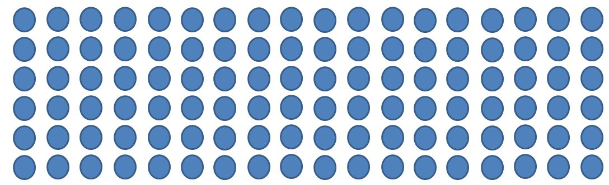

# [Array Data Structure](https://www.w3schools.in/data-structures-tutorial/data-structures-arrays/)
> Array is a fixed-size sequenced collection of variables belonging to the same data types. The array has adjacent memory locations to store values. Since the array provides a convenient structure for representing data it falls under the category of the data structures in C. The syntax for declaring array are:
>
> *Element*: Each and every item stored in an array is termed as an element
>
> *Index*: each memory location of an element in an array is denoted by numerical index which is used for identifying the element
>
> — W3 Schools



# How it works
I mean, it's an array ...

# Exercises
Write a class or set of functions to create and manage an array data structure.

## Required functionality:
* Add an item to [the end of] the array: `const add = (data)`
* Remove an item from the array: `const remove = (data)`
* Find the first instance of a match if it exists: `const search = (data)`
* Find all indexes of data: `const findAll = (data)`
* Get the value at given index: `const getAtIndex = (index)`
* Get the length of the array: `const length = ()`
* Get a string representation of the array: `const print = ()`

## Test your code (Unit tests)
  * `add(1...2) find length()`
  * `add(1...4)`
  * `add(1...4) remove() one.`
  * `add(1...4) remove(1) add(1...2) and remove(1).`
  * `add(1...5) and search() invalid`
  * `add(1...5) and findAll()`
  * `add(1...4) and getAtIndex()`

Use the following fixtures for each test scenario:
```
[]
[9, 2, 5, 6, 4, 3, 7, 10, 1, 8]
[10, 9, 8, 7, 6, 5, 4, 3, 2, 1, 0, -10]
[1, -10]
[10]
```

# Explanation(s) & Example(s)
## Adding
Add 1 then 2 to `[]`
```
Add 1 -> []
Add 2 -> [1]
[1, 2]
```

## Removing
Remove 5 from `[1, 2, 3, 4, 5, 6]`
```
array = [1, 2, 3, 4, 5, 6]
array2[] = array.length - 1

WHILE array @ index !== 5
  array2.add(array @ index)
ENDFOR

```

## Searching
Find the first instance of the data passed in (as parameter).

```
FOR CURR !== array.length
  IF array[CURR] === DATA
    RETURN array[CURR]
ENDFOR
```

## Find All
```
indexes = []
FOR CURR !== array.length
  IF array[CURR] === DATA
    indexes.push(array[CURR])
ENDFOR
```

## Get Data at Index
```
return array[INDEX]
```

## Length
Using any current language you can easily get the length parameter using the following. Not useful though as we know the size at create time.
```
return array.length
```

## Print
Get a string representation of an array.
```
FOR CURR !== array.length
  PRINT array[CURR]
ENDFOR
```
___
# Bibliography
*Yes, I am doubling up Citations & Bibliography. Deal with it however you need to.* <br />
[1] [Data Structures and Arrays](https://www.w3schools.in/data-structures-tutorial/data-structures-arrays/) - W3Schools, Jan 09, 2016<br />
