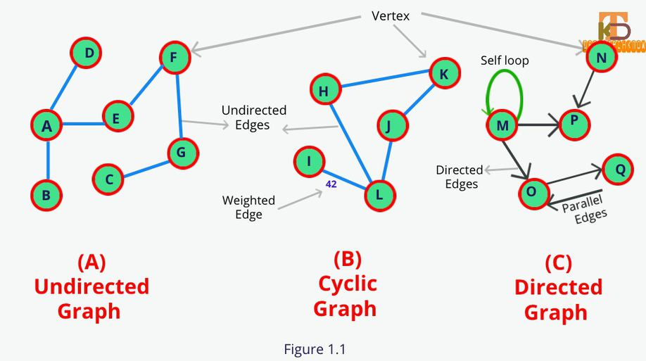

# [Heading](wiki-link)
Wiki intro text.

## Credit
Most of this is from https://github.com/mgechev/javascript-algorithms but converted to ES6 with my own tests and a ton of comments.

## Topic Diagram ([From: DroidTechKnow](https://www.droidtechknow.com/programming/data-structure/an-introduction-to-graph-data-structure/)))


# How it works
Explain how the algo works. 

# Exercises
* Add & Remove vertex
* Add & Remove edge
* How many vertices? How many edges?
* Depth first search
* Breadth first search
* Print out the path from Vertex x to Vertex Y
* Test your code (Unit tests)
    * [9, 2, 5, 6, 4, 3, 7, 10, 1, 8]
    * [10, 9, 8, 7, 6, 5, 4, 3, 2, 1, 0, -10]
    * [1, -10]
    * [10]
* Make sure to draw a multi-step diagram of how the method works.

## Example(s)
First example
```
// An ASCII example of how the data will be manipulated
```

Second Example
```
// An ASCII example of how the data will be manipulated
```
___
# Bibliography
*Yes, I am doubling up Citations & Bibliography. Deal with it however you need to.* <br />

[1] [Wikipedia](https://en.wikipedia.org/wiki/Graph_(abstract_data_type)) - Ievgen Terpil, March 2019<br />
[2] [Graphs representation - YouTube](https://www.youtube.com/watch?v=k1wraWzqtvQ&index=10&list=PLLXdhg_r2hKA7DPDsunoDZ-Z769jWn4R8) - My Code School, Oct 24, 2016<br />
[3] [Graph Algorithms for Technical Interviews - YouTube](https://www.youtube.com/watch?v=tWVWeAqZ0WU)

# Resources
* http://blog.benoitvallon.com/data-structures-in-javascript/the-graph-data-structure/
* https://github.com/datavis-tech/graph-data-structure
* https://khan4019.github.io/front-end-Interview-Questions/graph.html
* https://khan4019.github.io/front-end-Interview-Questions/tree.html
* https://github.com/trekhleb/javascript-algorithms/tree/master/src/data-structures/hash-table
* https://www.baeldung.com/cs/graph-adjacency-and-incidence
