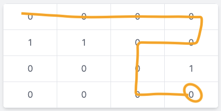
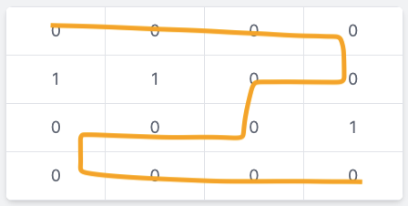
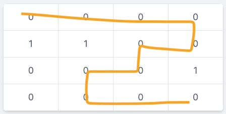
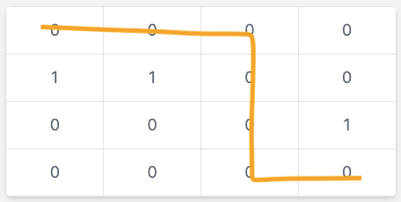
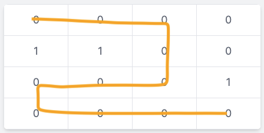
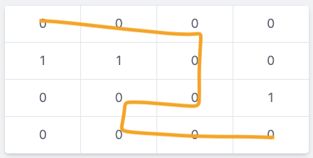

# [Depth First Search](https://www.geeksforgeeks.org/depth-first-search-or-dfs-for-a-graph/)

## Preamble
> Depth First Traversal (or DFS) for a graph is similar to Depth First Traversal of a tree. The only catch here is, that, unlike trees, graphs may contain cycles (a node may be visited twice). To avoid processing a node more than once, use a boolean visited array. A graph can have more than one DFS traversal. - Geeks for Geeks

In this case we'd work with an adjacency matrix. This matrix uses values to determine which path we can move to or not. If the cell contains a `0` our algorithm will follow that track to see where to go next. If it's a `1` think of it as a wall. You cannot go through.

Our algorithm will always start top-left and attempt to find all the paths that reach bottom-right. Here's an example matrix with a single path. Follow the `0`s from top-left to top-right then to bottom right.

```js
const matrix = [
  [0, 0, 0, 0],
  [1, 1, 1, 0],
  [1, 1, 1, 0],
  [1, 1, 1, 0],  
]
```

## Algorithm
It is important to understand that traversal is recursive. We will do our bounds checking at the beginning of the function then recurse through the next paths and continue until we have extinguished all possible valid paths.

### Search next valid paths
Starting with the traversal (i.e. no bounds checking) we take the current parameters passed to the function and add or subtract to the next cell (re: sample below) and give it the culmination of the visited paths thus far. Starting at the coordinates `0, 0` (top-left) we know that if we want to go up we'll take the passded in `r` and add 1 to go up. Same with the other 3 paths to be taken. Remember, we cannot go not move in diagonals paths.

As you can see this is straight forward as we're recursivly calling the function to search the next cell. This part of the algorithm is recursive and checks each of the 4 directions (2D) for the next valid path. When each call happens (let's say `UP`) we do the out of bounds check. If the path isn't legit it'll return 0 negating this path from consideration. If it's valid we'll return 1 as a valid path and adds it to the score of all paths.

Last thing to remember is that the inital state of this function is `0, 0` and we're checking from that point forward when we call `validPaths([ [], [], [] ])`

```js
count += helper(r + 1, c, visited) // Up
count += helper(r - 1, c, visited) // Down
count += helper(r, c + 1, visited) // Right
count += helper(r, c - 1, visited) // Left
```
### Path Found

### Bounds checking
We need to check to make sure we aren't out of bounds of the array. We each path (`up`, `down`, `left`, `right`) to make sure that we are still within the bounds of the matrix. If it so happens that we are out of bounds we return 0 as it isn't a valid path.

Was cell previously visited? This is done to ensure we do not end up in an infinite cycle. For instance, if a matrix has 4 `0`s it will do a loop through all the cells forever. We track previously walked paths so we do not end up destroying our computers.

```js
const matrix = [
  [0, 0],
  [0, 0],
]
```
This has 2 paths as is. If we were to modify the `wasVisited` predicate to the following
```js
const wasVisited = false //visited.has(`${r}-${c}`)
```

Our program would infinitely call itself and thusly blowup the callstack. 

```sh
RangeError: Maximum call stack size exceeded

   6 |  * @returns boolean
   7 |  */
>  8 | export const isInvalidPath = (grid) => (r, c) => (
     |                               ^
   9 |   // Make sure we can even access
  10 |   grid[r] !== undefined && grid[r][c] !== undefined
  11 |     // Can access, return if next cell is a 1

  at grid (src/data-structures/graph/depth-first.js:8:31)
  at isInvalidPath (src/data-structures/graph/depth-first.js:30:30)
  at helper (src/data-structures/graph/depth-first.js:51:14)
  at helper (src/data-structures/graph/depth-first.js:52:14)
  at helper (src/data-structures/graph/depth-first.js:51:14)
  (...)
```

---

## Walk through
Given a matrix as thus
```js
const matrix = [
  [0, 0, 0, 0],
  [1, 1, 0, 0],
  [0, 0, 0, 1],
  [0, 0, 0, 0],
]
```

The paths that the DFS function would find as valid (6 paths):








