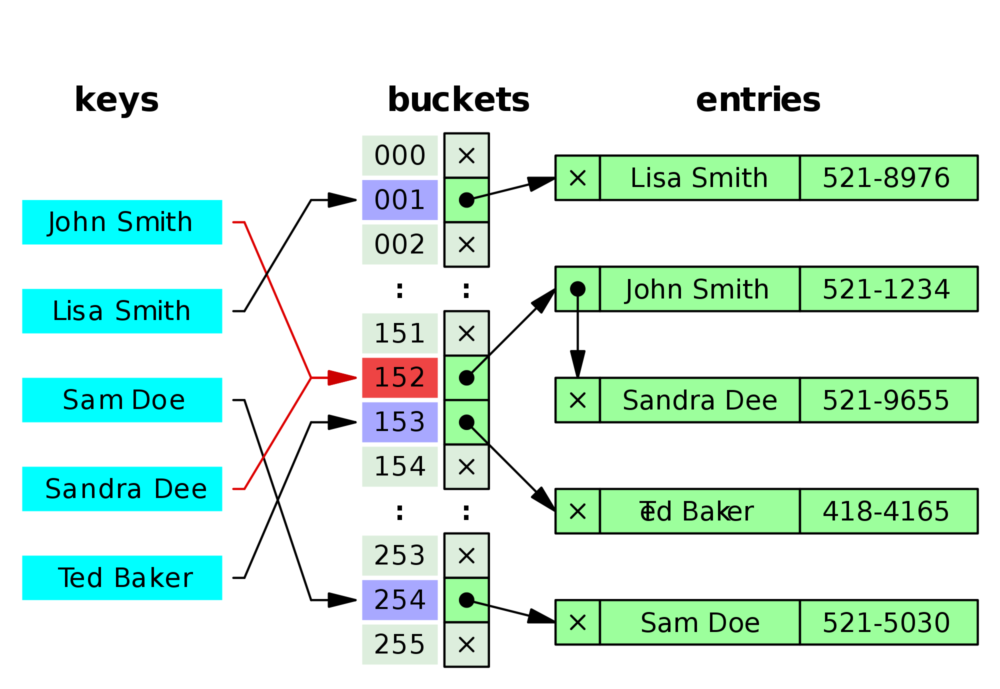

# [Hash Table Data Structure](https://en.wikipedia.org/wiki/Hash_table)
> In computing, a hash table (hash map) is a data structure which implements an associative array abstract data type, a structure that can map keys to values. A hash table uses a hash function to compute an index into an array of buckets or slots, from which the desired value can be found.
>
> In a well-dimensioned hash table, the average cost (number of instructions) for each lookup is independent of the number of elements stored in the table. Many hash table designs also allow arbitrary insertions and deletions of key-value pairs, at (amortized) constant average cost per operation.


– Image from [Wikipedia](https://en.wikipedia.org/wiki/Hash_table)

# How it works
## Hashing function
> A hash function takes a group of characters (called a key) and maps it to a value of a certain length. The hash value is representative of the original string of characters, but is normally smaller than the original.
>
> Hashing is done for indexing and locating items.

## Collisions
A hash function will sometimes return the same values for two different keys. If this happens then we need to handle a way to still store that key/data. To illustrate one method, and the only method I will bother to code, is below in the chaining section.

### Structure Example (Chaining)
This ASCII example comes from "Notes on Hashing" [3]. This uses chaining instead of linear probing which is easier to work with. This is instead of figuring out the sorting of collisions within the table in a linear fashion (yuck).

Given 4 keys `Krista`, `Allen`, `Peter` and `Susan` we want to enter them into our hash table. Our hashing function isn't the best and determines that one of them, `Krista`, has a unique hash/index and the other three end up with the same. That means that `Allen`, `Peter` and `Susan` are collisions. What we'll plan to do is store them all at the same index/hash (in an array or linked list or what-have-you it's dealer's choice).

What that example would end up looking like is as thus:

```
name        Hash(name)
----        ----------
Krista	        3
Allen	          8
Peter	          8
Susan	          8


  0   1   2   3   4   5   6   7   8   9
-----------------------------------------
|   |   |   |   |   |   |   |   |   |   |
--------------|-------------------|------
              |                   |
            Krista              Allen
                                  |
                                Peter
                                  |
                                Susan
```

# Exercises
Write a class or set of functions to create and manage a hash table

## Required functionality:
* Create the hash function: `const calculateHash = (str)`
* Write an insert into hash function: `const insert = (key, value)`
* Get an item from the hash table: `const get = (key)`
* Remove something from the hash table: `const remove = (key)`
* Calculate the length: `const length = ()`

## Test your code (Unit tests)
* `add(1...5) get length() and test hash keys`
* `add(1) and search()`
* `add(1...5) and remove() each`
* `add(1...5), remove(1...4), add(1) and lastly remove()`

A note on the fixture. It would be useful to dynamically build a fixture to test against.

# Explanation(s) & Example(s)
## Calculate Hash
Hashing is a technique to convert a range of key values into a range of indexes of an array. Consider an example of hash table of size 20, and the following items are to be stored.

```
key.length % tableSize
```

## Insert
Before inserting we will first compute the hash code of the key passed and locate the index using that hash code as an index in the array.

```
PROCEDURE
  hash = calculateHash(key)
  WHILE EXISTS table[hash]
    INSERT table[hash] = value

  numValues++
ENDPROCEDURE
```

## Get
something
```
PSEUDOCODE
  ...
ENDPSEUDOCODE
```
## Remove
something
```
PSEUDOCODE
  hash = calculateHash(key)

  WHILE (dictionary[hash].length)
    return dictionary[hash]
  ENDWHILE
ENDPSEUDOCODE
```

## Length
something
```
PSEUDOCODE
  return numValues
ENDPSEUDOCODE
```
___
# Bibliography
[1] [Hash Table](https://en.wikipedia.org/wiki/Hash_table) - Wikipedia, Sept 27, 2001‎ <br />
[2] [Hash Function](https://www.techopedia.com/definition/19744/hash-function) - Techopedia<br />
[3] [Notes on Hashing](http://pages.cs.wisc.edu/~siff/CS367/Notes/hash.html) - Wisconsin University<br />
