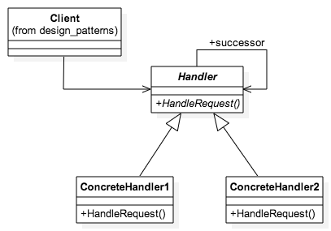

# Chain of Responsibility
Reference image [[source](http://loredanacirstea.github.io/es6-design-patterns/#chain-of-responsibility)]:

Chain of responsibility pattern is used to achieve loose coupling in software design where a request from client is passed to a chain of objects to process them. Later, the object in the chain will decide themselves who will be processing the request and whether the request is required to be sent to the next object in the chain or not.

## Where and When Chain of Responsibility pattern is applicable:
When you want to decouple a request’s sender and receiver
* Multiple objects, determined at runtime, are candidates to handle a request
* When you don’t want to specify handlers explicitly in your code
* When you want to issue a request to one of several objects without specifying the receiver explicitly.

This pattern is recommended when multiple objects can handle a request and the handler doesn’t have to be a specific object. Also, handler is determined at runtime. Please note that that a request not handled at all by any handler is a valid use case.

## Sender Receiver & Request
These are the 3 parts to the CoR pattern.

### Sender
The sender makes the request
### Receiver
The receiver is a chain of 1 or more objects that choose whether to handle the request or pass it on
### Request
The request itself can be an object that encapsulates all the appropriate data

# Realworld Example(s)
The DOM.

> Event handling in the DOM uses one implementation of the Chain of Responsibility (amazing how many patterns are used together in the DOM, isn’t it). Once an event is fired, it _bubbles _up the DOM hierarchy, calling every event handler it runs into until it either gets to the end of the chain or a handler tells it to stop propagating. - [Chains in the World Around Us - JavaScript Corner](https://www.joezimjs.com/javascript/javascript-design-patterns-chain-of-responsibility#Chains-in-the-World-Around-Us)
___
# Bibliography
[1] [JavaScript Design Patterns: Chain of Responsibility](https://www.joezimjs.com/javascript/javascript-design-patterns-chain-of-responsibility/) - JavaScript Corner, Feb 20 2012 
[2] [es6-design-patterns](http://loredanacirstea.github.io/es6-design-patterns/#chain-of-responsibility) - loredanacirstea 
