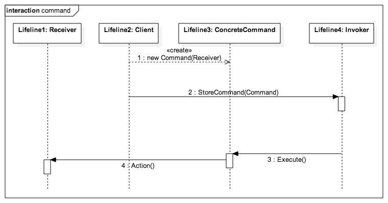

# Chain of Responsibility

Class Pattern [[source](https://en.wikipedia.org/wiki/Command_pattern)]
___

Interaction [[source](http://loredanacirstea.github.io/es6-design-patterns/#command)]

> In object-oriented programming, the command pattern is a behavioral design pattern in which an object is used to encapsulate all information needed to perform an action or trigger an event at a later time. This information includes the method name, the object that owns the method and values for the method parameters. - Wikipedia

Command decouples the object that invokes the operation from the one that knows how to perform it. Basically the command pattern [black] boxes up all needed functionality to take an action and it is completely independent of any context from the caller.

## Where and When Command pattern is applicable:
- [Possible Uses](https://en.wikipedia.org/wiki/Command_pattern#Uses)

# Realworld Example(s)

___
# Bibliography
[1] [Command Pattern](https://en.wikipedia.org/wiki/Command_pattern) - Wikipedia, Jan 3 2003 
