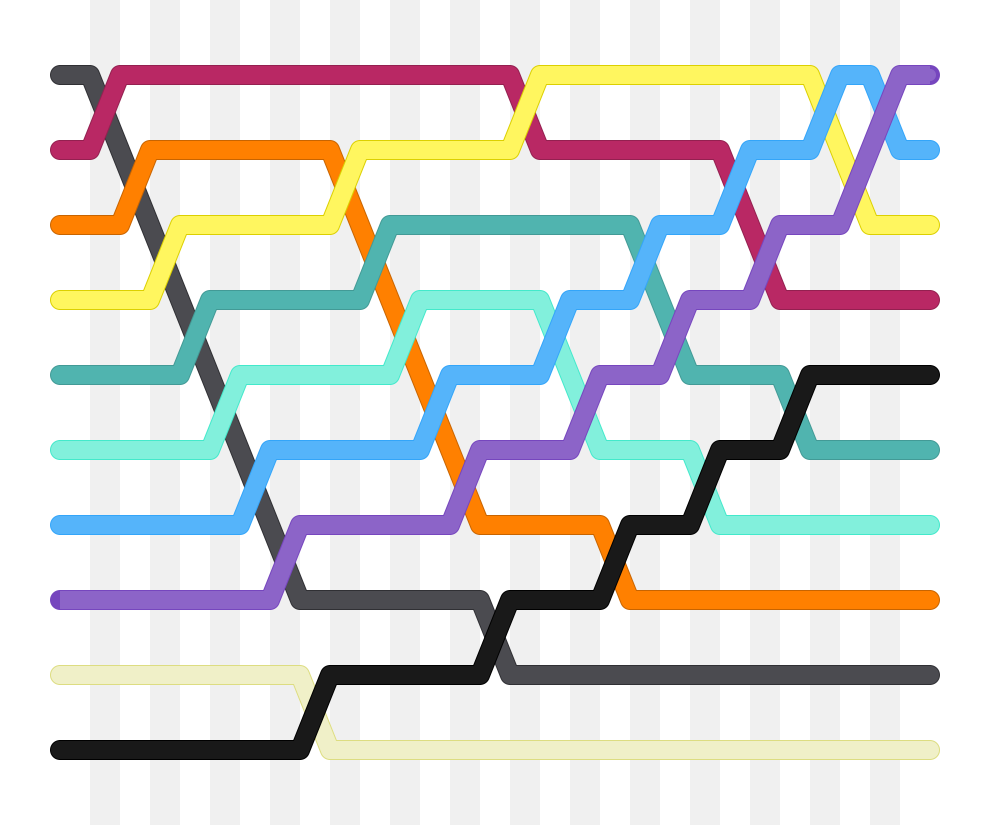

# [Bubble Sort](https://en.wikipedia.org/wiki/Bubble_sort)
Bubble Sort is the simplest sorting algorithm that works by repeatedly swapping the adjacent elements if they are in wrong order.

## Example

First Pass
```
( 5 1 4 2 8 ) –> ( 1 5 4 2 8 ), Here, algorithm compares the first two elements, and swaps since 5 > 1.
( 1 5 4 2 8 ) –>  ( 1 4 5 2 8 ), Swap since 5 > 4
( 1 4 5 2 8 ) –>  ( 1 4 2 5 8 ), Swap since 5 > 2
( 1 4 2 5 8 ) –> ( 1 4 2 5 8 ), Now, since these elements are already in order (8 > 5), algorithm does not swap them.
```

Second Pass
```
( 1 4 2 5 8 ) –> ( 1 4 2 5 8 )
( 1 4 2 5 8 ) –> ( 1 2 4 5 8 ), Swap since 4 > 2
( 1 2 4 5 8 ) –> ( 1 2 4 5 8 )
( 1 2 4 5 8 ) –>  ( 1 2 4 5 8 )
```
Now, the array is already sorted, but our algorithm does not know if it is completed. The algorithm needs one whole pass without any swap to know it is sorted.

Third Pass
```
( 1 2 4 5 8 ) –> ( 1 2 4 5 8 )
( 1 2 4 5 8 ) –> ( 1 2 4 5 8 )
( 1 2 4 5 8 ) –> ( 1 2 4 5 8 )
( 1 2 4 5 8 ) –> ( 1 2 4 5 8 )
```

## Diagram


# Exercises
* Write the binary search.
* Write your unit tests.
* Make sure to draw a multi-step diagram of how the method works.

Source: http://www.geeksforgeeks.org/bubble-sort/
