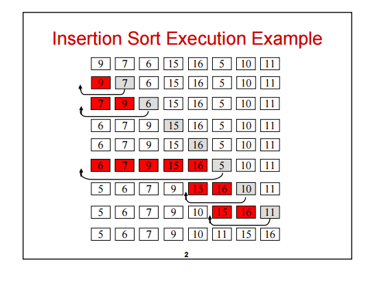

# [Insertion Sort Assignment](http://www.geeksforgeeks.org/insertion-sort/)
Insertion sort is a simple sorting algorithm that works the way we sort playing cards in our hands.

Time Complexity: `O(n*n)`

## Algorithm
```
// Sort an arr[] of size n
insertionSort(arr, n)
Loop from i = 1 to n-1.
...a) Pick element arr[i] and insert it into sorted sequence arr[0…i-1]
```

## Diagram ([From Wikipedia](https://en.wikipedia.org/wiki/Bubble_sort))


# Exercises
* Write the insertion search.
    * Do not forget to add your comment headers.
* Test your code (Unit tests)
    * [9, 2, 5, 6, 4, 3, 7, 10, 1, 8]
    * [10, 9, 8, 7, 6, 5, 4, 3, 2, 1, 0, -10]
    * [1, -10]
    * [10]
* Make sure to draw a multi-step diagram of how the method works.

## Example
*12*, 11, 13, 5, 6

Let us loop for i = 1 (second element of the array) to 5 (Size of input array)

i = 1. Since 11 is smaller than 12, move 12 and insert 11 before 12
*11*, *12*, 13, 5, 6

i = 2. 13 will remain at its position as all elements in A[0..I-1] are smaller than 13
*11*, *12*, *13*, 5, 6

i = 3. 5 will move to the beginning and all other elements from 11 to 13 will move one position ahead of their current position.
*5*, *11*, *12*, *13*, 6

i = 4. 6 will move to position after 5, and elements from 11 to 13 will move one position ahead of their current position.
*5*, *6*, *11*, *12*, *13*,
___
# Bibliography
[1] [Insertion Sort](http://www.geeksforgeeks.org/insertion-sort/) - GeeksforGeeks, March 2013<br />
