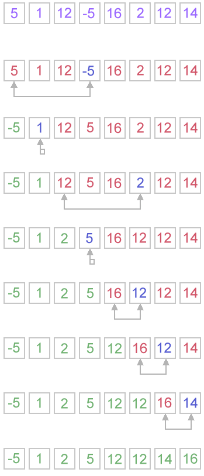

# [Selection Sort Assignment](http://www.geeksforgeeks.org/selection-sort/)
In computer science, selection sort is a sorting algorithm, specifically an in-place comparison sort. It has `O(n2)` time complexity, making it inefficient on large lists, and generally performs worse than the similar insertion sort. Selection sort is noted for its simplicity, and it has performance advantages over more complicated algorithms in certain situations, particularly where auxiliary memory is limited.

The algorithm divides the input list into two parts: the sublist of items already sorted, which is built up from left to right at the front (left) of the list, and the sublist of items remaining to be sorted that occupy the rest of the list. Initially, the sorted sublist is empty and the unsorted sublist is the entire input list. The algorithm proceeds by finding the smallest (or largest, depending on sorting order) element in the unsorted sublist, exchanging (swapping) it with the leftmost unsorted element (putting it in sorted order), and moving the sublist boundaries one element to the right.

## Diagram ([Concept Draw](http://www.conceptdraw.com/examples/flowchart-for-selerction-sorting))


# Exercises
* Write the selection sort.
    * Do not forget to add your comment headers.
* Test your code (Unit tests)
    * [9, 2, 5, 6, 4, 3, 7, 10, 1, 8]
    * [10, 9, 8, 7, 6, 5, 4, 3, 2, 1, 0, -10]
    * [1, -10]
    * [10]
* Make sure to draw a multi-step diagram of how the method works.

## Example
The selection sort algorithm sorts an array by repeatedly finding the minimum element (considering ascending order) from unsorted part and putting it at the beginning. The algorithm maintains two subarrays in a given array.

1. The subarray which is already sorted.
2. Remaining subarray which is unsorted.

In every iteration of selection sort, the minimum element (considering ascending order) from the unsorted subarray is picked and moved to the sorted subarray.

Following example explains the above steps:
```
arr[] = 64 25 12 22 11

// Find the minimum element in arr[0...4]
// and place it at beginning
11 25 12 22 64

// Find the minimum element in arr[1...4]
// and place it at beginning of arr[1...4]
11 12 25 22 64

// Find the minimum element in arr[2...4]
// and place it at beginning of arr[2...4]
11 12 22 25 64

// Find the minimum element in arr[3...4]
// and place it at beginning of arr[3...4]
11 12 22 25 64
```

___
# Bibliography
[1] [Selection Sort](http://www.geeksforgeeks.org/selection-sort/) - GeeksforGeeks, January 2014<br />
